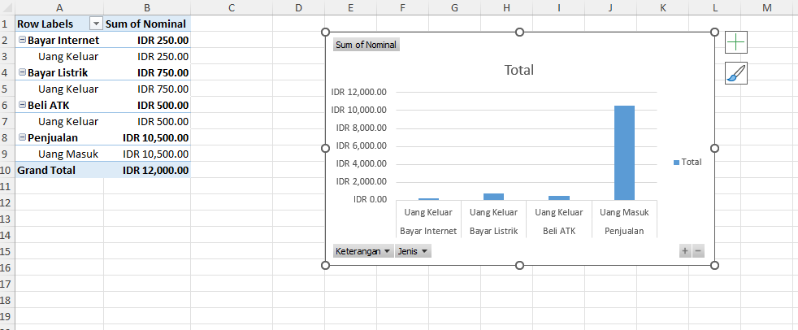

# Nama Project

Contoh Pengerjaan Data Pada Excel

## 🚀 Fitur
-Hitung Total
  -Pemasukan
  -Pengeluaran

-Laba/Rugi
  -Keuntungan
  -kerugian
  

-MemBuat Jurnal Sederhana

-Membuat Pivot
  -Pivot Table

  -Pivot Chart

